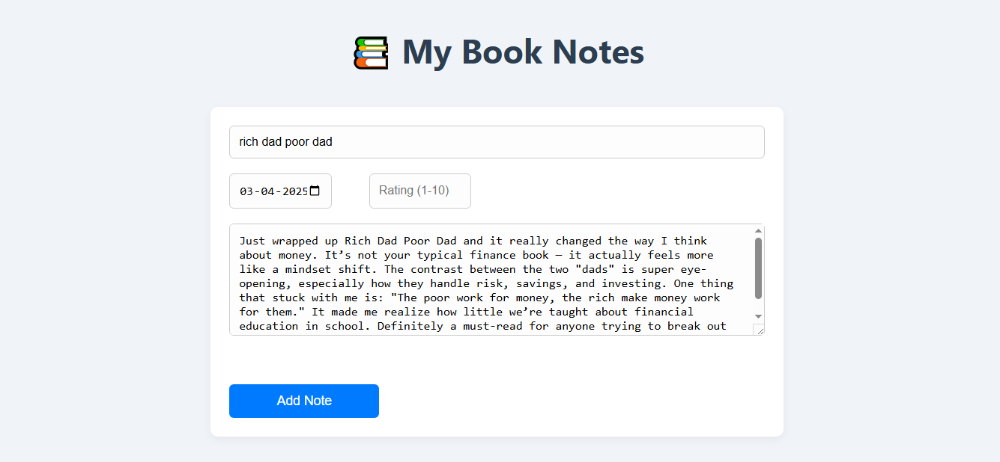
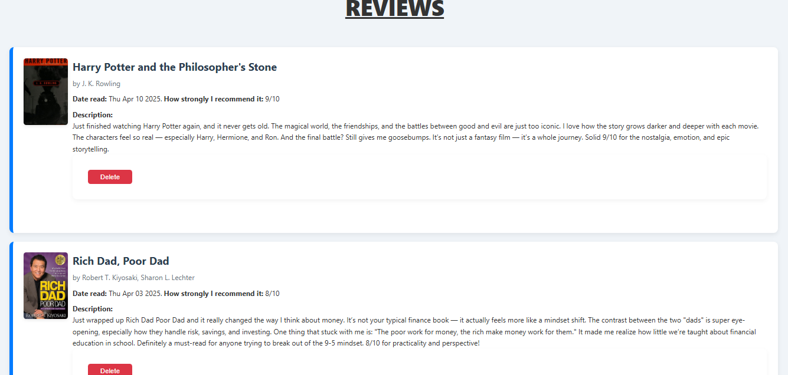

# Rate It Now App

**Rate It Now App** allows users to rate the books they've read and provide detailed notes about them. This app also integrates an external book cover API to fetch book cover images, making the user experience more visually engaging.

# Preview




### Features
- Add your own book reviews, including a title, author, rating, notes, and the date you read the book.
- View a gallery of your book reviews with corresponding cover images fetched via a book cover API.
- Delete a book review if you wish to update or remove it.
- User-friendly interface with a simple layout for easy interaction.

### Book Cover API

This app uses the **[Open Library Covers API](https://openlibrary.org/developers/cover_images)** to fetch cover images for the books. It provides a simple way to retrieve book cover images by specifying the ISBN or key of a book. If a book cover exists in their database, the app will display it.

### Technologies Used
- **Frontend**: HTML, CSS, JavaScript (EJS)
- **Backend**: Node.js, Express.js
- **Database**: Postgres (or you could use any database of choice for storing book reviews)
- **External API**: Open Library API for book cover images

### How to Run the App Locally

1. Clone the repository:
   ```bash
   git clone https://github.com/yourusername/RateItNowApp.git
   npm install
   ```
2. Change Your Databse inside index.js
